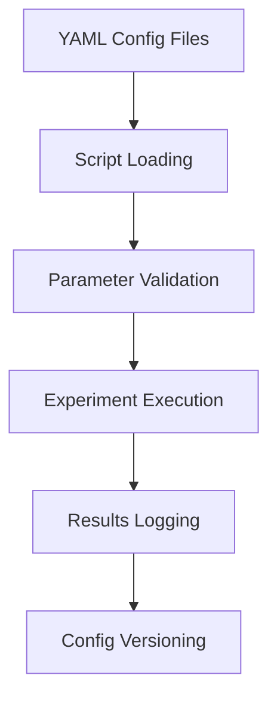

# ⚙️ Configuration Directory

This directory contains YAML configuration files that centralize all project parameters for reproducible machine learning experiments.

## 📋 **Purpose & Configuration Management**

The `configs/` folder implements **centralized configuration management** using YAML files to ensure reproducible experiments and easy parameter tuning across the entire clickbait spoiler classification pipeline.

## 📄 **Configuration Files**

### 🗃️ **Data Configuration (`data_config.yaml`)**
```yaml
Purpose: Dataset paths and preprocessing parameters
- Input/output directory paths
- File naming conventions
- Data split ratios and random seeds
- Unicode cleaning parameters
- Validation settings
```

### 🏷️ **Spoiler Classification Config (`spoiler_classification_config.yaml`)**
```yaml
Purpose: Task 2 classification model parameters
- SBERT model specifications (all-MiniLM-L6-v2)
- Feature engineering parameters  
- ML algorithm configurations (RF, SVM, LR)
- Cross-validation settings (5-fold stratified)
- Hyperparameter optimization ranges
- Evaluation metrics and thresholds
```

### 📝 **Spoiler Generation Config (`spoiler_generation_config.yaml`)**
```yaml
Purpose: Task 1 generation model parameters
- GPT-2 model configuration
- Tokenization settings (max 512 tokens)
- Training hyperparameters
- Text formatting templates
- Generation constraints
```

## 🎯 **Configuration Philosophy**

### **Centralized Management**
- **Single source of truth** for all project parameters
- **Version control** for experiment reproducibility
- **Easy parameter tuning** without code modification
- **Environment-specific** configurations

### **Hierarchical Structure**
```
configs/
├── data_config.yaml          # Data pipeline settings
├── spoiler_classification_config.yaml  # ML classification params
└── spoiler_generation_config.yaml      # Text generation params
```

## 🔧 **Key Configuration Categories**

### **Data Processing**
- **Paths**: Input/output directories and file patterns
- **Preprocessing**: Unicode cleaning and normalization rules
- **Features**: SBERT model selection and embedding dimensions
- **Splits**: Train/validation ratios and random seeds

### **Model Training**
- **Algorithms**: Machine learning model parameters
- **Validation**: Cross-validation folds and metrics
- **Optimization**: Hyperparameter search spaces
- **Evaluation**: Performance thresholds and reporting

### **Reproducibility**
- **Random Seeds**: Fixed values for consistent results
- **Model Versions**: Specific transformer model identifiers  
- **Hardware**: CPU/GPU preferences and memory settings
- **Logging**: Output verbosity and file locations

## 📊 **Configuration Examples**

### **Classification Model Setup**
```yaml
sbert:
  model_name: "all-MiniLM-L6-v2"
  embedding_dim: 384
  max_seq_length: 512

ml_models:
  random_forest:
    n_estimators: [100, 200, 300]
    max_depth: [10, 20, 30]
  
  svm:
    C: [0.1, 1, 10]
    kernel: ['linear', 'rbf']
```

### **Data Pipeline Config**
```yaml
data:
  raw_dir: "data/raw"
  processed_dir: "data/processed"
  train_file: "train.jsonl"
  validation_file: "validation.jsonl"

preprocessing:
  unicode_cleaning: true
  max_sequence_length: 512
  random_seed: 42
```

## 🚀 **Usage Integration**

### **Script Integration**
All processing scripts automatically load configurations:
- `preprocess_data.py` → `data_config.yaml`
- `train_classifier.py` → `spoiler_classification_config.yaml`
- Custom generation scripts → `spoiler_generation_config.yaml`

### **Parameter Override**
Command-line arguments can override config values:
```bash
python scripts/train_classifier.py --config configs/spoiler_classification_config.yaml --random_seed 123
```

## 🔄 **Configuration Workflow**



## 🎯 **Benefits**

### **Reproducibility**
- **Exact parameter tracking** for all experiments
- **Version control** of configuration changes
- **Environment consistency** across different machines

### **Flexibility**
- **Easy parameter tuning** without code changes
- **Multiple configuration profiles** for different experiments
- **Batch experiment execution** with parameter sweeps

### **Maintainability**
- **Clear separation** of code and configuration
- **Documentation** of parameter choices and rationale
- **Team collaboration** through shared configuration files

---

**🎯 Result**: Centralized, version-controlled configuration enabling reproducible 85.5% accuracy experiments 