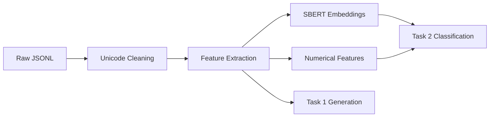

# 📊 Data Directory

This directory manages all datasets throughout the clickbait spoiler classification pipeline, from raw input to processed ML-ready features.

## 📋 **Purpose & Data Flow**

The `data/` folder implements a **structured data management system** that transforms raw SemEval-2023 clickbait data into machine learning features through multiple processing stages.

## 🗂️ **Directory Structure**

```
data/
├── raw/           # Original SemEval-2023 dataset files
├── cleaned/       # Unicode-cleaned and normalized data  
└── processed/     # ML-ready features and embeddings
    ├── task1/     # Spoiler generation features (GPT-2)
    └── task2/     # Classification features (SBERT + ML)
```

## 📄 **Data Components**

### 📁 **Raw Data (`raw/`)**
- **Source**: SemEval-2023 Clickbait Spoiler Dataset from Zenodo
- **Format**: JSONL (JSON Lines) format
- **Files**:
  - `train.jsonl` - 3,200 training samples
  - `validation.jsonl` - 800 validation samples
- **Content**: Original clickbait posts with spoilers and metadata
- **Size**: ~4,000 clickbait posts total

### 🧹 **Cleaned Data (`cleaned/`)**
- **Purpose**: Unicode normalization and character cleaning
- **Process**: Automated by `clean_unicode_auto.py`
- **Improvements**:
  - Removes 36+ types of problematic Unicode characters
  - Normalizes quotation marks, dashes, and spaces
  - Fixes encoding issues and zero-width characters
- **Output**: Clean JSONL files ready for feature extraction

### 🔨 **Processed Data (`processed/`)**

#### **Task 1: Spoiler Generation (`task1/`)**
- **Purpose**: Features for GPT-2 fine-tuning
- **Input Format**: `"POST: {text} TARGET: {paragraphs} SPOILER:"`
- **Files**:
  - `train_processed.csv` - Tokenized training data
  - `validation_processed.csv` - Tokenized validation data
- **Features**:
  - `input_text` - Formatted input for GPT-2
  - `target_tokens` - Tokenized spoiler text
  - `input_length` - Token count (max 512)
  - `target_length` - Spoiler length (max 128)

#### **Task 2: Classification (`task2/`)**
- **Purpose**: Features for SBERT + ML classification
- **Target**: 3-class spoiler type prediction (phrase/passage/multi)
- **Files**:
  - `train_processed.csv` - Numerical + categorical features
  - `validation_processed.csv` - Validation features
  - `train_embeddings.pkl` - SBERT embeddings (384-dim × 4 fields)
  - `validation_embeddings.pkl` - Validation embeddings

## 🧮 **Feature Engineering Details**

### **Numerical Features (5 dimensions)**
- `post_length` - Word count of clickbait post
- `spoiler_length` - Word count of spoiler text
- `target_length` - Word count of target content
- `keywords_count` - Number of target keywords
- `has_description` - Binary flag for target description

### **SBERT Embeddings (1,536 dimensions)**
- **Model**: `all-MiniLM-L6-v2` (384-dim per field)
- **Fields** (4 × 384 = 1,536):
  - `post_text` embeddings - Clickbait post content
  - `spoiler` embeddings - Spoiler text content  
  - `target_paragraphs` embeddings - Related article content
  - `target_keywords` embeddings - Extracted keywords

### **Total Feature Space**
- **Combined**: 1,541 features (5 numerical + 1,536 embeddings)
- **Format**: Standardized for ML model input
- **Labels**: Mapped to integers (phrase=0, passage=1, multi=2)

## 📊 **Data Statistics**

### **Dataset Distribution**
```
Total Samples: 4,000
├── Training: 3,200 (80%)
└── Validation: 800 (20%)

Spoiler Types:
├── phrase: 1,708 (42.7%) - Short phrases
├── passage: 1,592 (39.8%) - Text passages  
└── multi: 700 (17.5%) - Multiple parts
```

### **Processing Metrics**
- **Unicode cleaning**: 36,171 characters cleaned across dataset
- **Tokenization**: GPT-2 tokenizer with 512 token limit
- **Embeddings**: ~24MB total size for SBERT features
- **Processing time**: ~15-30 minutes on modern hardware

## 🔄 **Data Pipeline Flow**



## 🎯 **Quality Assurance**

- **Validation**: Automatic data type and range checking
- **Reproducibility**: Fixed random seeds for consistent splits
- **Backup**: Original files preserved in `raw/` directory
- **Logging**: Comprehensive processing logs and statistics

---

**📈 Result**: High-quality 1,541-dimensional feature space enabling 85.5% classification accuracy 